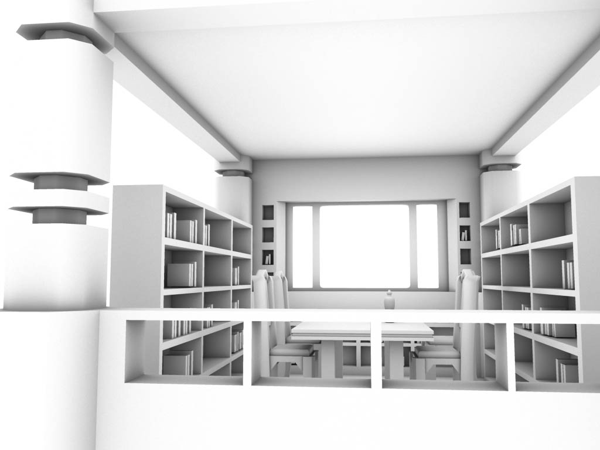
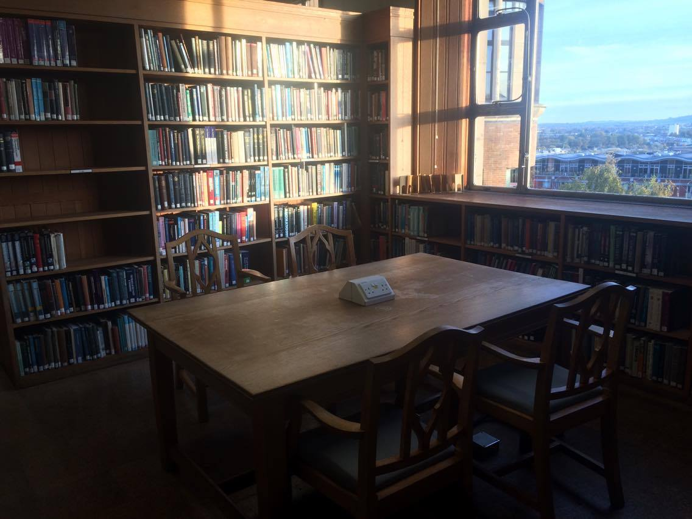
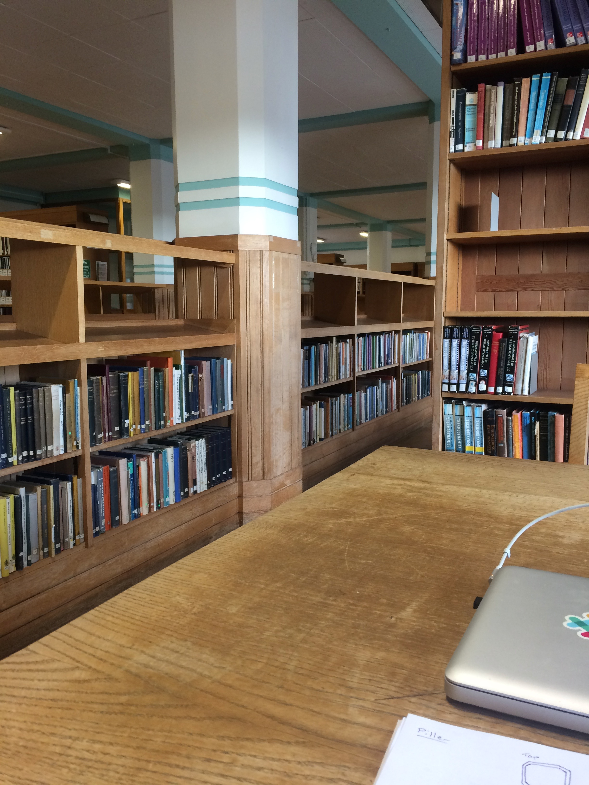
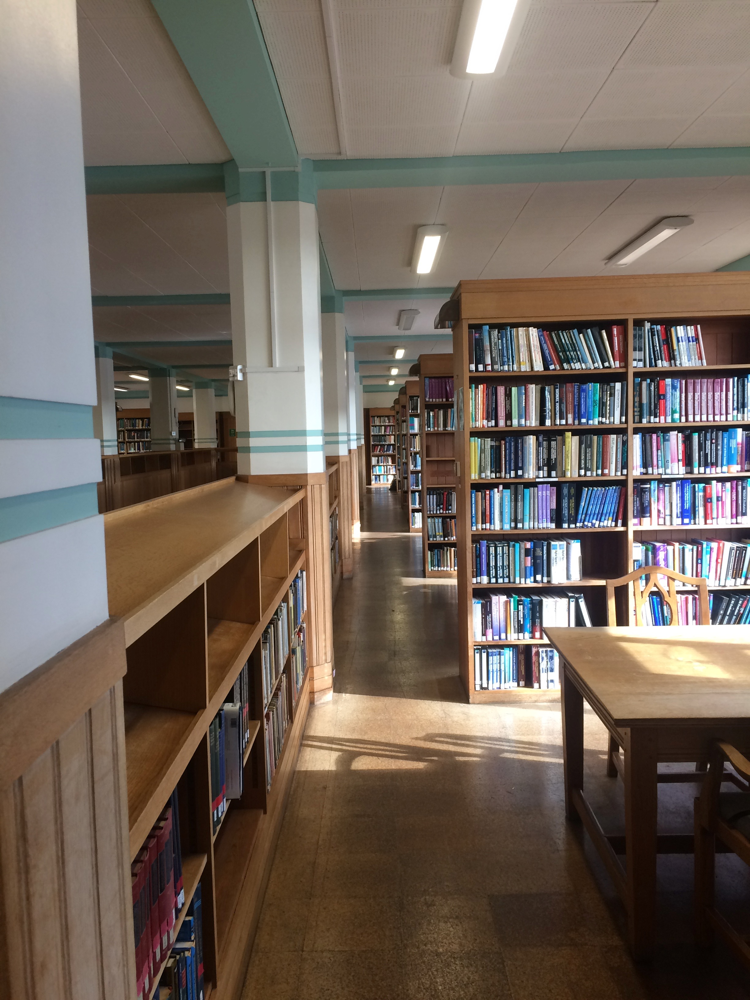
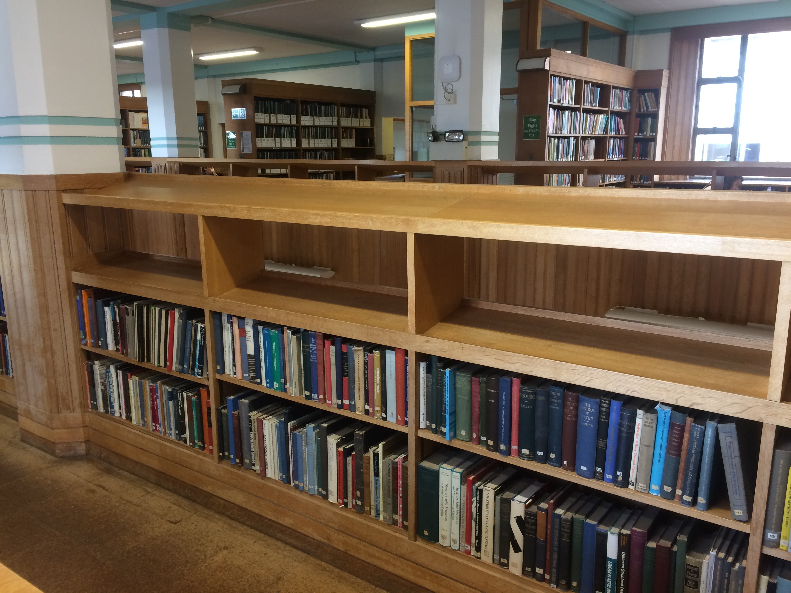
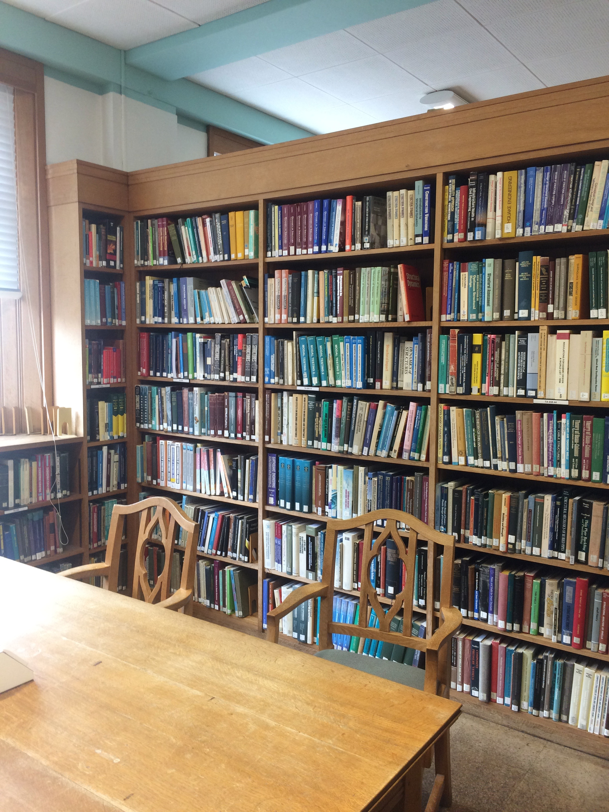

# Queens Library: 3D Render

A 3D model of Queens Library (University of Bristol) using Maya.

Queens Library gallery:

Read more about how I created it, from [this detailed report](report.pdf).
